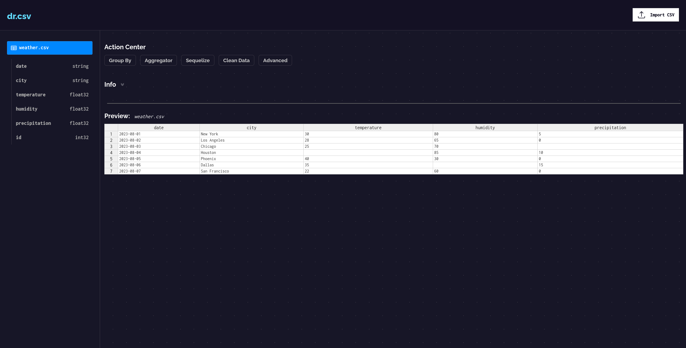
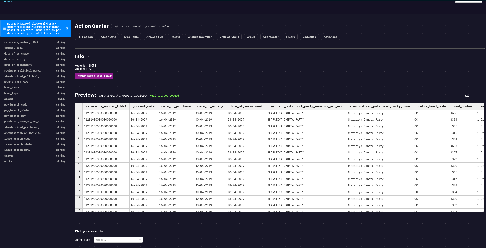
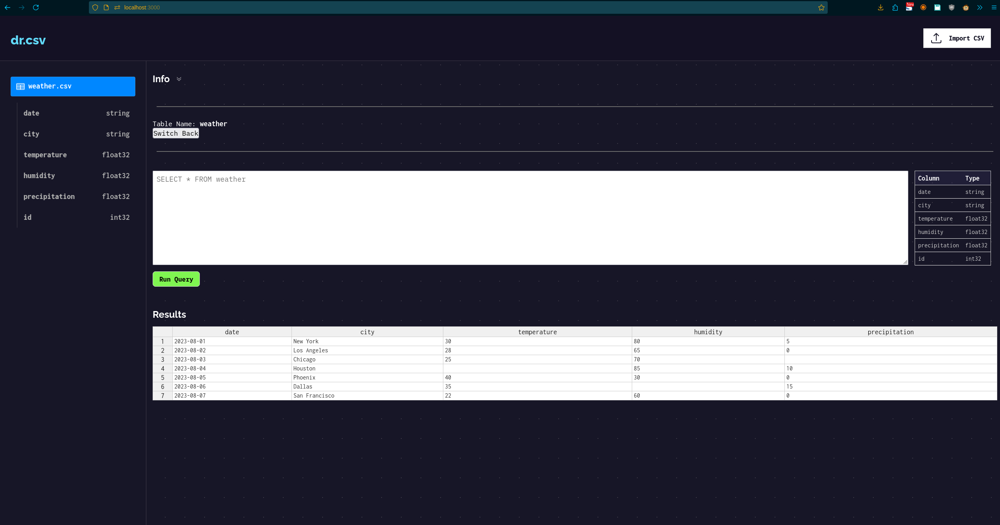

# drcsv

Cleanup, Analyze, Export your CSV documents. Plot your results.

This project is based on vite react template which provides a minimal setup to get React working in Vite with HMR and some ESLint rules.

Currently, two official plugins are available:

- [@vitejs/plugin-react](https://github.com/vitejs/vite-plugin-react/blob/main/packages/plugin-react/README.md) uses [Babel](https://babeljs.io/) for Fast Refresh
- [@vitejs/plugin-react-swc](https://github.com/vitejs/vite-plugin-react-swc) uses [SWC](https://swc.rs/) for Fast Refresh

## Usage

There are two ways to upload a csv file:

1. Import the CSV
2. Append the remote URL to q url query param. [Example Data](https://drcsv.onrender.com?url=https://raw.githubusercontent.com/ikouchiha47/drcsv/refs/heads/master/testdata/orders1k.csv)

## Available Scripts

Why Vite? Because fuck create-react-app for consuming 8.9G memory.

In the project directory, you can run:

### `npm run dev`

Runs the app in the development mode.\
Open [http://localhost:3000](http://localhost:3000) to view it in your browser.

The page will reload when you make changes.\
You may also see any lint errors in the console.

### `npm run build`

Builds the app for production mode with .env.production

## Screenshot

